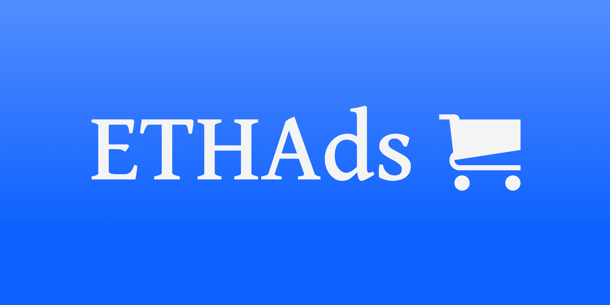

<div align="center">
    <br/>
  
  <p><br/></p>
  <h3>Web3Ads</h3>
  <strong>🛒 AD marketplace revolutionizing Web3 advertising 🛒</strong>
</div>

<div align="center">
    <h3>Tech Stack</h3>
    <br/>
    <div>
        <strong><p>Client</p></strong>
        
        
        
        
    </div>
    <br/>
    <div>
        <strong><p>Blockchain</p></strong>
        
        
        
    </div>
</div>
<br/>
<br/>

> **EthAds** is a chain-specific AD marketplace revolutionizing Web3 advertising with on-chain performance tracking and targeted campaigns for crypto projects. Maximize your marketing impact in the decentralized world.

## Description

EthAds is an innovative solution addressing critical challenges in the Web3 advertising landscape. Our platform offers a comprehensive approach to crypto marketing, solving two major problems:

1. Chain-specific AD targeting: The crypto ecosystem is diverse, with different blockchains catering to various categories. EthAds enables projects to reach their target audience effectively by providing chain-tailored advertisements.
2. Web3 AD performance tracking: Traditional metrics fall short in the decentralized space. EthAds empowers crypto projects to measure and optimize their marketing efforts using real, on-chain data.

Our platform features a user-friendly interface with Web3auth integration, supporting both social and wallet-based authentication. Publishers can easily register new advertisements, inputting details like pricing, descriptions, and banner imagery. Smart contracts are seamlessly linked to the publisher's wallet, ensuring secure and transparent transactions.

Advertisers can connect their MetaMask wallets and browse the marketplace for suitable ad spaces. The purchase process triggers smart contract interactions, maintaining the integrity of the Web3 ecosystem.

EthAds incorporates a crucial verification step, allowing publishers to review and approve incoming ad requests. This safeguard helps prevent potential civil advertising infractions and maintains the quality of the advertising ecosystem.

### Installation

```
# Add dependencies
yarn install

# Update Submodules (Smart Contract)
git submodule init
git submodule update
git submodule foreach git checkout master
```
